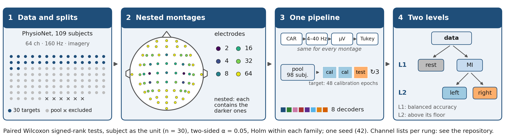
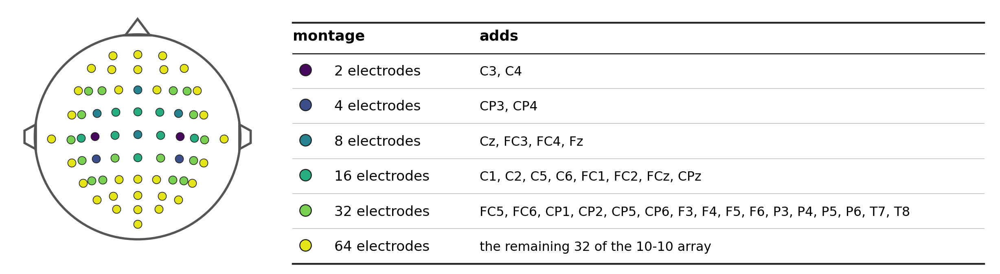
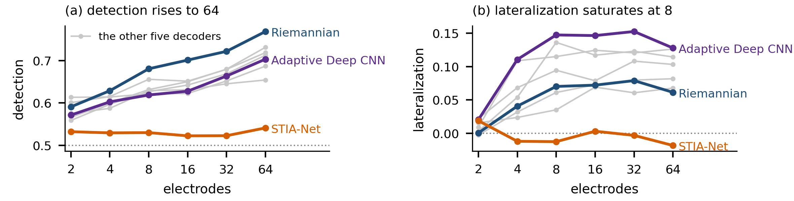

# In hand motor imagery, electrode reduction costs detection rather than lateralization

Code, per-epoch results, statistics and figures for the paper

> Bitencourt, F. C., Pereira, E. T., Salvalaio, C., Falk, T. H., Recamonde Mendoza, M., and
> Oliveira Jr, A. A. de (2026). *In hand motor imagery, electrode reduction costs detection rather
> than lateralization.* II Escola Regional de Aprendizado de Máquina e Inteligência Artificial da
> Região Sul (ERAMIA-RS 2026), SBC.

A wearable brain–computer interface must decide two things with few electrodes: **when** the user
intends to act (detection) and **which hand** (lateralization). We measure what electrode density
costs each of them on a nested ladder of six montages, from 64 to 2 electrodes, with eight decoders
on 30 subjects of the PhysioNet EEG Motor Movement/Imagery Database. Reduction is paid for by
detection: down to 8 electrodes, lateralization keeps 97% of its value at 64, while detection above
chance keeps 66%.



*Figure 1 of the paper: the evaluation pipeline.*

## Contents

```
README.md                  this file
download_physionet.py      fetches EEGMMIDB into data_base_physionet/
requirements.txt           package versions the results were reproduced with
core/                      data loading, preprocessing and metrics      (research code, as run)
modelos/                   the eight decoders                           (research code, as run)
experiments/hierarquico-8/
  _bench_montagens.py      the benchmark runner: montage x decoder x target x fold
  _contrato.py             the shared preprocessing and training "contract", and its stamp
  _orquestra_montagens.sh  how the full grid was launched (one CPU and one GPU stream)
  _monitor_montagens.py    progress monitor
results/bench_contrato_mi/ the published run: metrics and per-epoch predictions
  ml/   CSP+LDA, FBCSP+SVM, Riemannian
  deep/ EEGNet, EEGSym, ShallowConvNet, Adaptive Deep CNN, STIA-Net
results/stats/             Wilcoxon tests behind every claim of the paper (CSV and Markdown)
analysis/
  figure1_methods.py       Figure 1 of the paper (the pipeline above)
  figures.py               Figure 2 of the paper, plus supplementary figures
  methodology_figure.py    shared checks and style; also draws a text-only variant (Figure S1)
  stats.py                 the statistical report
  compare_runs.py          compares a fresh run with the published one
figures/                   every figure in PNG (400 dpi), SVG and PDF
```

The research code is published as it was run, so its comments and identifiers are in Portuguese
(`montagem` = montage, `modelo` = decoder, `alvo` = target, `carimbo` = stamp). The scripts in
`analysis/` were written or adapted for this repository.

## Protocol

| | |
|---|---|
| data | PhysioNet EEGMMIDB: 109 subjects, 64 electrodes, 160 Hz; imagery runs 4, 8, 12; epochs 0.5–2.5 s after the cue; three classes: rest (T0), left hand (T1), right hand (T2) |
| targets | 30 subjects: 3, 7, 12, 18, 22, 25, 31, 34, 41, 45, 49, 52, 57, 60, 63, 68, 71, 76, 79, 83, 87, 91, 95, 98, 102, 105, 106, 107, 108, 109 |
| pool | the 30 targets are split into 6 groups of 5 (seed 42); each group's model trains on the other 98 subjects. Six subjects excluded by a quality audit, none of them a target, never enter a pool: 38, 88, 89, 92, 100, 104 |
| calibration | the target's epochs are split into 3 rotated partitions: 2 calibrate, 1 tests. The calibration budget is absolute, 48 epochs, at every density |
| preprocessing | applied once, the same for every montage and decoder: channel selection → common average reference (after selection) → 4–40 Hz Butterworth, order 5 → microvolts → Tukey epoch rejection (k = 1.5) |
| training | imagery runs only (`--fases mi`); pool training, then calibration of a copy of the pool model on the target |
| decoders | CSP+LDA, FBCSP+SVM, Riemannian, EEGNet, EEGSym, ShallowConvNet, Adaptive Deep CNN, STIA-Net |
| evaluation | the three-class output is read at two levels. Level 1, detection (rest vs imagery): balanced accuracy. Level 2, lateralization (left vs right): accuracy over all true imagery epochs, whose chance is 0.5 (1 − FNR); we report the distance above that floor |
| statistics | paired Wilcoxon signed-rank tests with the subject as the unit (n = 30), two-sided, α = 0.05, Holm correction within each family of tests |

### Decoders

The eight decoders come from our scoping review of machine learning for EEG hand motor imagery
(Bitencourt et al., ERAMIA-RS 2025). Five follow the study they were taken from; CSP+LDA, EEGNet and
ShallowConvNet are there for their transversal presence in the literature and are cited at the
canonical source. The implementations follow each description without being integral
reproductions; the table lists what differs. Every divergence is also declared, with its reason, in
`MODELOS` of `experiments/hierarquico-8/_contrato.py`, and the runner refuses to start if a decoder
redefines a field of the shared contract.

| decoder | family | input | source | as run here, and what differs from the source |
|---|---|---|---|---|
| CSP+LDA | spatial filter | band-limited epoch → log-variance of 6 CSP components | Ramoser et al. 2000 | 6 components, Ledoit–Wolf regularized covariance |
| FBCSP+SVM | spatial filter | 9 sub-bands of 4 Hz, 4–40 Hz → 4 CSP components per band → 12 features chosen by mutual information | Liu et al. 2023 | source: 7 sub-bands over 4–30 Hz, 2 components per band, 10 features. Linear SVM, C = 1, with probability outputs |
| Riemannian | Riemannian | Ledoit–Wolf covariance → tangent space → logistic regression | Racz et al. 2024 | source: DCCA covariance and MDM classifier, 8–30 Hz. Here Ledoit–Wolf covariance (no DCCA), tangent space, logistic regression, 4–40 Hz |
| EEGNet | deep, compact CNN | epoch, channels × 320 samples | Lawhern et al. 2018 | F1 = 16, D = 4, F2 = 64, dropout 0.5 (source: F1 = 8, D = 2, F2 = 16) |
| EEGSym | deep, symmetric CNN | epoch split into left and right hemispheric branches | Pérez-Velasco et al. 2022 | 8 filters, dropout 0.4. The branches are assigned from each montage's channel names; the source fixes 8 or 16 channels |
| ShallowConvNet | deep, shallow CNN | epoch, channels × 320 samples | Schirrmeister et al. 2017 | 40 filters, temporal kernel 25, pooling 75 / stride 15, dropout 0.5 |
| Adaptive Deep CNN | deep CNN | epoch, channels × 320 samples | Zhang et al. 2021 | Deep ConvNet, four conv–pool blocks, dropout 0.5. The subject adaptation is the shared calibration below |
| STIA-Net | deep, graph + attention | epoch, plus a phase-locking-value graph between channels | Ma et al. 2022 | GCN (64, 32) in parallel with a dilated TCN (16, 32, 64) and 8-head attention, dropout 0.5; source band 8–30 Hz, here 4–40 Hz |

What is shared, and therefore not in the table:

- **Output.** Every decoder has two binary heads, detection (rest vs imagery) and lateralization
  (left vs right), combined into the three-class output that is scored.
- **Signal.** The preprocessing above is applied once by the runner; no decoder filters or
  re-references again, which is why the source bands of FBCSP+SVM, Riemannian and STIA-Net are not used.
- **Pool training.** Imagery runs of the 98 pool subjects. Deep decoders: Adam, learning rate 10⁻³,
  weight decay 10⁻⁴, batch 16, up to 200 epochs, early stopping with patience 20 on a 15% split.
- **Calibration on the target** (48 epochs). Classical decoders keep the spatial filters, or the
  tangent-space reference, estimated on the pool and refit only the classifier heads. Deep decoders
  fine-tune the whole network on a copy of the pool model: learning rate 10⁻⁴, up to 80 epochs,
  patience 15.

### Montages

The ladder is nested: each montage contains all the smaller ones, and the runner aborts at start-up
if it does not. Rungs follow the distance to C3 and C4, except the one of 8, which adds Cz and Fz.

| electrodes | adds |
|---:|---|
| 2 | C3, C4 |
| 4 | CP3, CP4 |
| 8 | Cz, FC3, FC4, Fz |
| 16 | C1, C2, C5, C6, FC1, FC2, FCz, CPz |
| 32 | FC5, FC6, CP1, CP2, CP5, CP6, F3, F4, F5, F6, P3, P4, P5, P6, T7, T8 |
| 64 | the remaining 32 electrodes of the array |



*The ladder with the electrodes added at each rung (the Figure 1 of the submitted version, kept here as the reference for the channel lists).*

## Results

Mean over the eight decoders and the 30 targets (each target averaged over its three test
partitions). Chance is 0.333 for three classes, 0.5 for detection and 0 for lateralization above
its floor.

| electrodes | 3-class balanced accuracy | 3-class kappa | detection | lateralization above floor |
|---:|---:|---:|---:|---:|
| 2 | 0.392 | 0.098 | 0.576 | 0.011 |
| 4 | 0.434 | 0.155 | 0.597 | 0.053 |
| 8 | 0.471 | 0.210 | 0.624 | 0.081 |
| 16 | 0.478 | 0.223 | 0.631 | 0.086 |
| 32 | 0.496 | 0.253 | 0.654 | 0.090 |
| 64 | 0.515 | 0.291 | 0.689 | 0.083 |



*Figure 2 of the paper: (a) detection and (b) lateralization above its floor, by density, mean over
30 targets. Highlighted: Riemannian, Adaptive Deep CNN and STIA-Net; light grey: the other five
decoders; dotted: chance (a) and floor (b). Figure S2 shows all eight decoders labelled.*

The headline tests (`results/stats/wilcoxon_tests.md` has all 45, with W⁺, W⁻ and effect sizes):

| contrast, all decoders | mean difference | W | p | p (Holm) |
|---|---:|---:|---:|---:|
| detection, 64 vs 8 electrodes | +0.065 | 11 | 1.0 × 10⁻⁷ | 8.2 × 10⁻⁷ |
| lateralization, 64 vs 8 electrodes | +0.002 | 179 | 0.28 | 0.28 (n.s.) |
| lateralization, 8 vs 2 electrodes | +0.070 | 45 | 3.0 × 10⁻⁵ | 6.1 × 10⁻⁵ |
| three-class kappa, 64 vs 8 electrodes | +0.081 | 13 | 1.6 × 10⁻⁷ | 9.8 × 10⁻⁷ |

### Supplementary figures

| file | content |
|---|---|
| `figures/fig1_montagens_en` | the ladder on the 64-electrode array with the channels of each rung (submitted Figure 1) |
| `figures/figS1_methodology_en` | a text-only variant of Figure 1, in five steps |
| `figures/figS2_all_decoders_en` | Figure 2 with every decoder coloured and named |
| `figures/figS3_confusion_en` | confusion matrices at 64, 8 and 2 electrodes: from 64 to 8, left/right swaps barely move (0.282 → 0.264) while imagery read as rest rises (0.271 → 0.309) |

## Reproducing

### 1. Environment

Python 3.12. The deep decoders need a CUDA build of PyTorch.

```bash
pip install -r requirements.txt
pip install torch==2.11.0 --index-url https://download.pytorch.org/whl/cu128
```

### 2. Recompute the paper's numbers, statistics and figures (no EEG data needed)

```bash
python analysis/stats.py
python analysis/figure1_methods.py
python analysis/figures.py
python analysis/methodology_figure.py
```

All of them read only `results/bench_contrato_mi/`. The exceptions are Figure 1 and the montage
figure, which read one recording (S001R04) for the electrode positions.

### 3. Get the data

```bash
python download_physionet.py
```

This fetches the hand runs of all 109 subjects (654 recordings, about 1.7 GB) into
`data_base_physionet/`, which is where `core/data_loader.py` reads them from. Re-running skips files
already downloaded.

### 4. Re-run the benchmark

The whole grid, as it was launched for the paper (11 montages, including the controls that the
paper does not report, times 8 decoders; one CPU stream for the classical decoders and one GPU
stream for the deep ones):

```bash
FASES=mi bash experiments/hierarquico-8/_orquestra_montagens.sh
```

A single cell, for example CSP+LDA on the 2-electrode montage over the 30 targets (about one
minute), written to a new folder:

```bash
cd experiments/hierarquico-8
python _bench_montagens.py --montagens 2 --modelos csp_lda --fases mi --out-dir results/check/ml
cd ../..
python analysis/compare_runs.py experiments/hierarquico-8/results/check/ml
```

Write new runs to a new folder. The runner resumes from the CSV it finds in `--out-dir`, so pointing
it at `results/bench_contrato_mi/` would skip every cell as already done.

**Verified.** The three classical decoders were re-run from this repository on the 2-electrode
montage, over the 30 targets, and compared cell by cell with the published results:

| decoder | re-run against published |
|---|---|
| CSP+LDA | **identical**: 48 metrics in 90 target × fold cells, and all 2,628 per-epoch predictions and probabilities |
| Riemannian | **identical**, by the same criteria |
| FBCSP+SVM | not identical: 32 of 90 cells change and 97.1% of predicted labels agree; the mean moves by at most 0.003 (kappa +0.0030, detection +0.0024) |

FBCSP+SVM has two unseeded random components, mutual-information feature selection
(`mutual_info_classif`) and Platt scaling in `SVC(probability=True)`. The code is published as it
was run, so they were left as they are. The deep decoders are seeded (`numpy` and `torch`, seed
42) but use cuDNN's default non-deterministic kernels, so a re-run on GPU can also differ slightly.
The paper runs a single seed and says so.

## Safeguards built into the runner

- **One owner for preprocessing.** `_contrato.prepara` selects channels, references, filters, rejects
  and rescales, once; the decoders are built so that they cannot filter or re-reference again.
- **A stamp for the conditions.** `carimbo(cfg)` hashes the conditions of a run (band, filter order,
  reference, rejection, calibration budget, training phases, scale…) into 10 characters. Every row
  carries it, the runner refuses to append to a CSV with a different stamp, and every published row
  has the same one: `5cb6c6358c`.
- **Nesting checked at start-up**, so the difference between rungs is density, not region.
- **Absolute calibration budget** (48 epochs), so fewer channels never means fewer calibration
  epochs as well.
- **Calibration that survives `copy.deepcopy`.** Each fold calibrates a deep copy of the pool model.
  Attaching the calibration routine as a closure would leave the copy's method pointing at the
  original model, so calibration would train the pool model and leak earlier folds' epochs into later
  ones. `_contrato._liga` binds it with `functools.partial` and dispatches through the class, which
  `deepcopy` rebuilds for the copy (correction B-A, documented in the code).

## Results files

`results/bench_contrato_mi/{ml,deep}/metricas.csv` has one row per montage × decoder × target × fold
(7,920 rows; the 6 montages of the paper are 4,320 of them). Main columns:

| column | meaning |
|---|---|
| `carimbo` | contract stamp of the run (`5cb6c6358c`) |
| `montagem`, `n_canais` | montage name and number of electrodes |
| `modelo`, `grupo`, `target`, `fold` | decoder, target group, target subject, test partition |
| `n_pool`, `n_calib_alvo`, `n_teste` | pool subjects, target calibration epochs, test epochs |
| `bca_3cls`, `kappa_3cls` | three-class balanced accuracy and kappa |
| `bca_detection`, `sensitivity_detection` | detection balanced accuracy and sensitivity (1 − FNR) |
| `accuracy_lateralization_given_mi` | left/right accuracy over all true imagery epochs; minus 0.5 × sensitivity gives the value above the floor |
| `cm_<true>_pred_<predicted>` | confusion counts |

`predicoes.csv` has one row per test epoch, with `y_true`, `y_pred` (0 rest, 1 left, 2 right) and
the three class probabilities. `ml.log` and `deep.log` are the console logs of the run.

## Licence

Code: MIT (see `LICENSE`). Results and figures: CC BY 4.0. The EEG data are not redistributed here.
EEGMMIDB is published by PhysioNet under the Open Data Commons Attribution License v1.0; its
[page](https://physionet.org/content/eegmmidb/1.0.0/) asks users to cite the dataset (Schalk, 2009,
https://doi.org/10.13026/C28G6P), the original publication (Schalk et al., *BCI2000: A
General-Purpose Brain-Computer Interface (BCI) System*, IEEE Trans. Biomed. Eng. 51(6):1034–1043,
2004) and the standard PhysioNet citation given there.

## Citation

See `CITATION.cff`.
